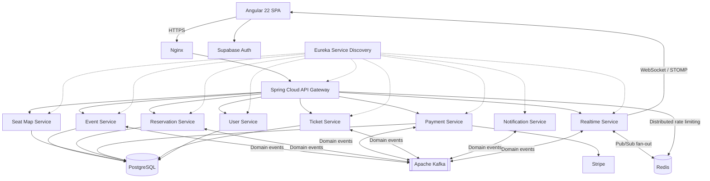
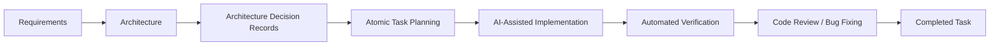

<div align="center">

# 🎟️ SeatFlow

### Production-oriented event ticketing platform built with Java, Spring Boot, Angular, and an event-driven microservice architecture.

**Concurrent seat reservations · Stripe payments · QR tickets · Staff scanner · Admin portal · Cloud deployment**

[](https://www.java.com/)
[](https://spring.io/projects/spring-boot)
[](https://angular.dev/)
[](https://www.typescriptlang.org/)
[](https://www.docker.com/)
[](https://cloud.google.com/)

### 🌐 [Live Demo — seat-flow.me](https://seat-flow.me)

</div>

---

## Overview

**SeatFlow** is a full-stack event ticketing platform designed around real-world booking challenges such as **concurrent seat reservations, temporary seat holds, online payments, real-time availability updates, digital ticket generation, and ticket validation**.

Rather than being implemented as a traditional CRUD application, SeatFlow uses a **microservice and event-driven architecture** composed of independently scoped Spring Boot services communicating through REST, Apache Kafka, Redis Pub/Sub, and WebSockets where appropriate.

The project covers the complete ticket lifecycle:

**event discovery → seat selection → temporary reservation → payment → ticket generation → QR validation**

It also provides separate interfaces and permissions for **customers, event staff, and administrators**.

---

## 🚀 Live Application

SeatFlow is deployed and publicly accessible at:

### **https://seat-flow.me**

You can create a regular user account and go through the customer booking experience, or use the demo accounts below to explore privileged functionality.

| Role | Email | Password | Access |
| --- | --- | --- | --- |
| 🎫 **Staff** | `staff@seat-flow.me` | `Staff1234` | QR ticket scanner and validation |
| 🛠️ **Administrator** | `admin@seat-flow.me` | `Admin1234` | Events, venues, users, pricing, and seat-map management |

> **Demo environment:** These credentials are intended for evaluating SeatFlow functionality.

---

## ✨ What SeatFlow Can Do

### 👤 Customer Experience

Users can:

- discover available events;
- inspect event and venue information;
- view interactive seat maps;
- see current seat availability;
- select individual seats;
- temporarily hold seats while completing checkout;
- purchase tickets through Stripe;
- receive digital tickets with unique QR codes;
- access purchased tickets from their profile;
- manage account settings;
- use supported guest checkout and guest-ticket flows.

### 🎟️ Reservation System

One of the main engineering challenges in a ticketing platform is preventing two customers from successfully purchasing the same seat.

SeatFlow implements a dedicated reservation workflow responsible for:

- 15-minute temporary seat holds;
- reservation expiration and cleanup;
- maximum ticket limits;
- reservation lifecycle management;
- conflict prevention during concurrent booking attempts;
- releasing expired holds safely across multiple application instances.

**PostgreSQL remains the source of truth for reservation correctness and seat ownership.** The reservation subsystem relies on transactional database guarantees, uniqueness constraints, and locking strategies, including `FOR UPDATE SKIP LOCKED` for multi-instance expiration processing.

Redis is deliberately kept out of the authoritative booking path so that a Redis outage cannot corrupt persisted reservation state.

### 💳 Payments

Payments are handled through **Stripe**.

The payment workflow connects successful checkout with the rest of the SeatFlow ecosystem so confirmed transactions can trigger subsequent processes such as:

- reservation confirmation;
- ticket creation;
- order confirmation;
- notification processing.

### 🎫 Digital Tickets

After a successful purchase, SeatFlow generates digital tickets containing unique ticket information and QR codes.

Users can access their tickets from the application, while the generated QR code can later be validated at the event entrance.

### 📱 Staff QR Scanner

SeatFlow includes a dedicated **Staff Portal** designed for event admission.

Authorized staff can use the browser-based QR scanner to:

- scan ticket QR codes;
- validate tickets;
- identify invalid tickets;
- detect tickets that have already been used;
- handle admission directly from a phone or computer.

The scanner is protected by role-based authorization and is only available to staff or appropriately privileged users.

### 🛠️ Administration Portal

Administrators have access to a dedicated management interface supporting:

- event creation and management;
- venue creation and editing;
- interactive seat-map design;
- event pricing configuration;
- user management;
- administrative operations.

This allows the same platform to cover both the **customer-facing ticket marketplace** and the **operational side of event management**.

---

## 🏗️ System Architecture

SeatFlow is organized around independently scoped backend services behind a central API Gateway.



---

## 🧩 Backend Services

The backend contains **8 business services plus an API Gateway and Eureka service discovery**.

| Service | Responsibility |
| --- | --- |
| **API Gateway** | Central API entry point, request routing, and distributed rate limiting |
| **Eureka Server** | Service discovery between Spring Boot services |
| **Event Service** | Event information and event lifecycle |
| **Seat Map Service** | Venues, layouts, sections, and seats |
| **Reservation Service** | Seat holds, concurrency control, and reservation lifecycle |
| **Payment Service** | Stripe payment workflow |
| **Ticket Service** | Ticket generation, retrieval, and validation |
| **Notification Service** | Asynchronous user notification processing |
| **Realtime Service** | WebSocket/STOMP updates with Redis-backed fan-out |
| **User Service** | User profiles, roles, and user-related operations |

---

## ⚙️ Technology Stack

### Backend

| Technology | Usage |
| --- | --- |
| **Java 21** | Main backend language |
| **Spring Boot 4.1** | Microservice framework |
| **Spring Cloud 2025.1** | Distributed-system infrastructure |
| **Spring Cloud Gateway** | API Gateway |
| **Netflix Eureka** | Service discovery |
| **Spring Security** | API security and authorization |
| **Maven** | Multi-module build and dependency management |
| **MapStruct** | DTO/entity mapping |
| **Lombok** | Boilerplate reduction |
| **SpringDoc OpenAPI** | API documentation |
| **Micrometer** | Application metrics |
| **Testcontainers** | Integration testing |
| **Resilience4j** | Resilience around synchronous inter-service calls |

### Frontend

| Technology | Usage |
| --- | --- |
| **Angular 22** | Frontend framework |
| **TypeScript 6** | Application language |
| **Angular Material** | UI components |
| **Tailwind CSS 4** | Styling and responsive layouts |
| **RxJS** | Reactive application flows |
| **Supabase Auth** | Authentication |
| **Stripe.js** | Payment integration |
| **STOMP.js / SockJS** | Real-time communication |
| **Leaflet** | Map functionality |
| **html5-qrcode** | Browser-based QR scanning |

### Data & Messaging

- **PostgreSQL 16** — authoritative persistent business data
- **Apache Kafka** — durable asynchronous communication between services
- **Kafka KRaft** — Kafka metadata management without ZooKeeper
- **Redis 7** — API Gateway rate limiting and distributed real-time Pub/Sub fan-out

### Cloud & DevOps

- **Docker**
- **Docker Compose**
- **Nginx**
- **Terraform**
- **Google Cloud Platform**
- **Google Compute Engine**
- **Google Artifact Registry**
- **Google Secret Manager**
- **GitHub Actions**
- **Workload Identity Federation**

### Observability

SeatFlow includes a dedicated observability stack rather than relying only on application logs:

- **Prometheus** — metrics collection
- **Grafana** — monitoring dashboards
- **Loki** — centralized logs
- **Tempo** — distributed tracing
- **Promtail** — log collection
- **OpenTelemetry**
- **Google Cloud Logging & Monitoring**

---

## 🧠 Engineering Highlights

SeatFlow was intentionally designed to explore problems commonly found in production backend systems rather than only demonstrating framework usage.

### Concurrent Seat Reservations

Seat availability cannot simply be represented by a boolean when multiple users may attempt to purchase the same seat at the same time.

Reservation correctness is enforced through PostgreSQL transactional guarantees and database-level constraints. Expired holds are processed in batches using `FOR UPDATE SKIP LOCKED`, allowing multiple service instances to perform cleanup without double-processing the same reservations.

### Transactional Outbox & Event-Driven Communication

Apache Kafka is used for workflows that benefit from asynchronous communication. Durable domain-event publication follows a **Transactional Outbox** approach so database state changes and the intention to publish their corresponding events remain coordinated.

This reduces tight coupling between services such as reservations, payments, tickets, notifications, and real-time updates.

### Real-Time Availability

A dedicated realtime service consumes domain events and publishes updates to connected clients through **WebSockets/STOMP**.

Redis Pub/Sub provides cross-instance fan-out so that clients connected to different realtime-service instances can receive the same updates while Kafka remains the durable asynchronous backbone.

### Distributed API Rate Limiting

The API Gateway uses Redis-backed rate limiting to share quota state across Gateway instances and protect write-heavy/public endpoints from abuse.

### Service Discovery & Resilience

Microservices register through **Netflix Eureka**, while synchronous service communication uses Spring Cloud LoadBalancer and resilience mechanisms instead of hard-coded service addresses.

### Role-Based Application Areas

SeatFlow separates functionality between:

- regular users;
- staff;
- administrators.

Frontend routing and backend authorization enforce the relevant access boundaries.

### Production Infrastructure as Code

The production environment is defined through **Terraform**, keeping infrastructure configuration version-controlled and reproducible.

### Secure CI/CD Authentication

GitHub Actions communicates with Google Cloud using **Workload Identity Federation**, avoiding long-lived Google Cloud service-account keys in the CI/CD pipeline.

### Observability

Metrics, logs, and traces are treated as part of the architecture rather than as an afterthought.

---

## ☁️ Production Deployment

SeatFlow is deployed on **Google Cloud Platform**.

The production environment runs on a Google Compute Engine instance hosting the containerized application stack through Docker Compose.

```text
Internet
   │
   ▼
Nginx :80/:443
   │
   ├── Angular SPA
   │
   └── API Gateway
          │
          └── Spring Boot Microservices

Infrastructure containers:
├── PostgreSQL 16
├── Redis 7
├── Apache Kafka
├── Prometheus
├── Grafana
├── Loki
├── Tempo
└── Promtail
```

Docker images are stored in **Google Artifact Registry**.

Sensitive production configuration is managed through **Google Secret Manager**, while infrastructure provisioning is automated through Terraform.

---

## 🤖 AI-Assisted Engineering Workflow

SeatFlow was developed using an **AI-assisted software engineering workflow**, with AI coding agents used as development accelerators rather than as a replacement for architecture, engineering judgment, or verification.

The repository contains a dedicated `.ai/` engineering workspace:

```text
.ai/
├── architecture/
├── decisions/
├── tasks/
├── workflows/
├── SeatFlow-Architecture-and-Implementation-Spec.md
├── MODEL_ROUTER.md
└── AI_MODEL_REFERENCE.md
```

Development follows a structured pipeline:



Large features are first decomposed into **small, deterministic implementation tasks**.

Individual task specifications define items such as:

- affected files;
- database schemas and migrations;
- DTO and service contracts;
- API endpoints;
- business invariants;
- implementation sequence;
- required tests;
- deterministic verification commands.

Architectural decisions that introduce meaningful trade-offs are documented through **Architecture Decision Records (ADRs)** before implementation.

AI agents are used across selected stages such as:

- architecture exploration and implementation planning;
- code generation and refactoring;
- code review;
- bug investigation;
- test generation;
- verification support.

The goal of this workflow is to combine the development speed of modern AI tooling with traditional software-engineering practices such as **explicit architecture, scoped tasks, automated tests, code review, and reproducible verification**.

The project owner remains responsible for architectural decisions, acceptance criteria, integration, testing, and the final codebase.

---

## 🧪 Development Process

The project follows an architecture-first workflow:

```text
Architecture
     ↓
Technical decision / ADR
     ↓
Atomic implementation task
     ↓
Dedicated feature branch
     ↓
Implementation
     ↓
Unit & integration tests
     ↓
Review / bug fixing
     ↓
Verification
     ↓
Merge into develop
```

This approach keeps implementation work scoped and prevents individual features from silently changing established architectural decisions.

---

## 📁 Repository Structure

```text
SeatFlow/
│
├── backend/
│   ├── common/
│   │
│   └── services/
│       ├── api-gateway/
│       ├── eureka-server/
│       ├── event-service/
│       ├── notification-service/
│       ├── payment-service/
│       ├── realtime-service/
│       ├── reservation-service/
│       ├── seat-map-service/
│       ├── ticket-service/
│       └── user-service/
│
├── frontend/
│   └── Angular application
│
├── infra/
│   ├── terraform/
│   ├── scripts/
│   └── runbooks/
│
├── .ai/
│   ├── architecture/
│   ├── decisions/
│   ├── tasks/
│   └── workflows/
│
└── .github/
    └── workflows/
```

---

## 🎯 What This Project Demonstrates

SeatFlow was built as a portfolio project focused on demonstrating practical backend and full-stack engineering skills, including:

- designing a multi-service Spring Boot architecture;
- modelling non-trivial business workflows and concurrency constraints;
- transactional reservation handling with PostgreSQL;
- asynchronous communication with Kafka and the Transactional Outbox pattern;
- distributed rate limiting and realtime fan-out with Redis;
- REST API design;
- real-time communication with WebSockets;
- authentication and role-based authorization;
- payment-provider integration;
- PostgreSQL data modelling;
- containerized deployments;
- Infrastructure as Code;
- CI/CD pipelines;
- production observability;
- cloud deployment;
- structured AI-assisted software development.

---

## 📜 License

This project is available under the **MIT License**.

See [`LICENSE`](LICENSE) for details.

---

<div align="center">

### Built as a production-oriented software engineering portfolio project.

**[🌐 Open SeatFlow](https://seat-flow.me)**

</div>
